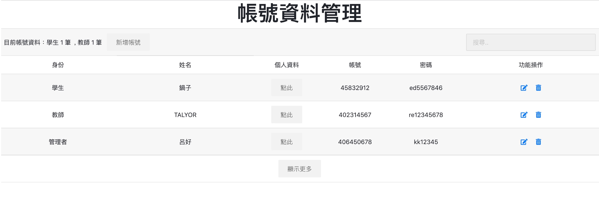

# 專題評分上傳系統 Project Scoring System

此專案為建構大學資訊專題上傳系統，學生可依據系上指定檔案文件上傳至本系統供評審老師進行審核

使用HTML、CSS、JavaScript、PHP、jQuery撰寫，搭配RDBMS儲存資料

## 功能

(1) 學生 
&nbsp;&nbsp;&nbsp;&nbsp;帳號資料 
&nbsp;&nbsp;&nbsp;&nbsp;&nbsp;&nbsp;* 修改密碼 
&nbsp;&nbsp;&nbsp;&nbsp;&nbsp;&nbsp;* 修改個人資料 
&nbsp;&nbsp;&nbsp;&nbsp;專題上傳專區 
&nbsp;&nbsp;&nbsp;&nbsp;&nbsp;&nbsp;* 上傳資料 
&nbsp;&nbsp;&nbsp;&nbsp;專題紀錄及評分結果 
&nbsp;&nbsp;&nbsp;&nbsp;&nbsp;&nbsp;* 詳細評分資料 
&nbsp;&nbsp;&nbsp;&nbsp;組員管理 
&nbsp;&nbsp;&nbsp;&nbsp;&nbsp;&nbsp;* 刪除成員 
&nbsp;&nbsp;&nbsp;&nbsp;&nbsp;&nbsp;* 新增成員 
 
 
(2) 教師 
&nbsp;&nbsp;&nbsp;&nbsp;學生資料管理 
&nbsp;&nbsp;&nbsp;&nbsp;&nbsp;&nbsp;* 新增學生資料 
&nbsp;&nbsp;&nbsp;&nbsp;&nbsp;&nbsp;* 更新學生資料 
&nbsp;&nbsp;&nbsp;&nbsp;&nbsp;&nbsp;* 刪除學生資料 
&nbsp;&nbsp;&nbsp;&nbsp;專題評分系統 
&nbsp;&nbsp;&nbsp;&nbsp;&nbsp;&nbsp;* 學生評分及系統文件下載頁面 
 
 
(3) 管理者 
&nbsp;&nbsp;&nbsp;&nbsp;帳號資料管理 
&nbsp;&nbsp;&nbsp;&nbsp;&nbsp;&nbsp;* 新增帳號資料 
&nbsp;&nbsp;&nbsp;&nbsp;&nbsp;&nbsp;* 更新帳號資料 
&nbsp;&nbsp;&nbsp;&nbsp;&nbsp;&nbsp;* 刪除帳號 
&nbsp;&nbsp;&nbsp;&nbsp;專題評分項目管理 
 
 

## 介面展示

僅就主要功能做介面展示

網站首頁

單一入口登入頁面，會依帳號類型自行判斷登入者身分

----

### 學生

登入首頁

學生組員名單 (判斷只有組長可進行編輯)

學生專題檔案上傳頁面

學生專題成績頁面

----

### 評審老師

登入首頁

學生名單管理頁面

專題成績批改頁面

----

### 管理者

登入首頁

帳號管理頁面

專題檔案類別管理頁面

